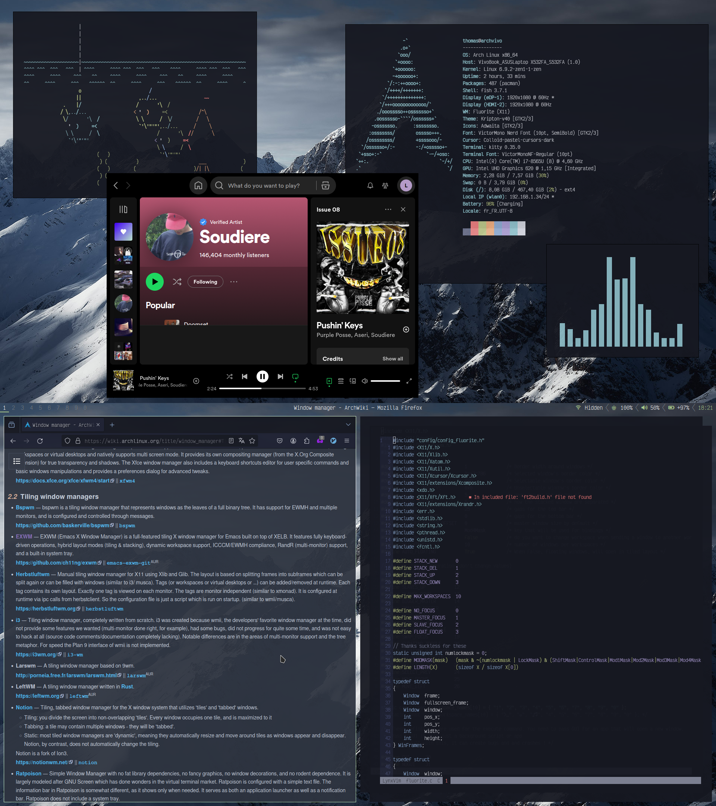

# Fluorite 1.0 (BETA)

Fluorite is a dynamic tiling window manager that aims to be light, functionnal, predictable, and beautiful.


*Rosé-pine Theme*


*Multimonitor Demo*

## Features

- Dynamic master layout tiling.
- Stacked layout (Monocle layout in DWM).
- Floating windows management.
- Static configuration for bindings, custom C functions and more, compiled with Fluorite.
- Dynamic configuration with auto-reload for styling.
- Organizer mode, let you swap windows freely.
- Works with multiple monitors. XMonad style.

## Why BETA ?

I'm trying to go for a stable release for early June (around 8... If you know you know). In this short period of time (writing this on 30 May), I would like to implement some more features and catch some bugs.

## Documentation ?

Go to [Fluorite Website](https://fluorite.surge.sh) for more informations. I talk about configuration, installation, ect...

You can also find some quick tips inside [CONFIG.md](./CONFIG.md).

# Installation (basic informations)

## Deps

On Archlinux you can type this command to install everything you need.

``` sh
sudo pacman -S xorg xdo libxft libxcomposite libxcursor libxrandr
```

## Build and install

After doing modifications to the config, just type (WITHOUT sudo). It will remake and copy the Fluorite executable to `/usr/bin/`.

``` sh
make install
```

## .xinitrc example

``` sh
setxkbmap -layout fr
polybar &
picom &
exec Fluorite
```

Keep in mind that the setxkbmap with the proper keyboard layout is *REQUIRED* so you can have all your bindings working.

## Known issues

- If java apps are clunky, you can add `export _JAVA_AWT_WM_NONREPARENTING=1` to you .xinitrc just before Fluorite execution.
